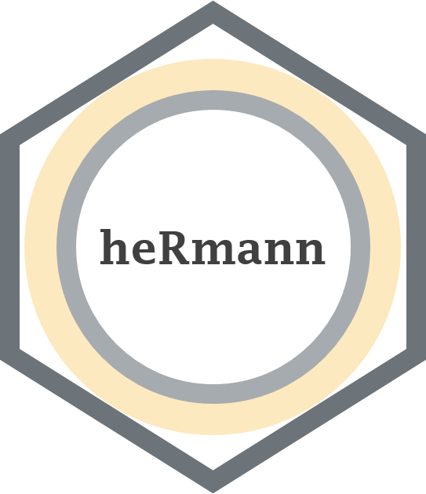

<!-- README.md is generated from README.Rmd. Please edit that file -->

# heRmann 

**Author**: [Mark Rieke](https://www.thedatadiary.net/about/about) <br/>
**License**:
[MIT](https://github.com/markjrieke/heRmann/blob/main/LICENSE)

## Overview

`{heRmann}` is a collection of functions for the Consumer Experience
Analytics (CXA) team at Memorial Hermann Health System. The package
provides convenience functions for interacting with Qualtrics’ API and
performing common survey-specific data manipulation tasks.

## Installation

This package is intentionally not available on CRAN. You can install the
most up-to-date version from github with the
[devtools](https://devtools.r-lib.org/) package.

``` r
devtools::install_github("markjrieke/heRmann")
```

## Usage

> put usage section here when you get a chance, dawg. Just create an
> example of nested IP/PIP/IPR data
